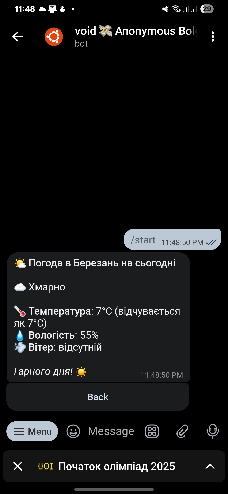

# ⛅ Weather bot

<div align="center">

[](https://wakatime.com/badge/user/5f28d705-3bc8-4138-8151-e12e0f9e9a23/project/4d3d812f-19d8-4e42-9ea5-2c7bd2a7e8fb)


**Сучасний Telegram-бот для отримання прогнозу погоди, написаний на Rust.**

</div>

---

## 📖 Про проєкт

Weather Bot — це швидкий та зручний Telegram-бот, який надає актуальний прогноз погоди для вашого міста. Написаний на Rust з акцентом на продуктивність, надійність та зручність використання.

## ⚡ Чому саме цей бот?

- 🚀 **Швидкість** — написаний на Rust для максимальної продуктивності
- 🎯 **Простота** — інтуїтивний інтерфейс без зайвих кроків
- 🌍 **Мультимовність** — підтримка української, англійської та німецької мов
- 🔒 **Надійність** — стабільна робота з PostgreSQL та якісним кодом

## ✨ Особливості

### 🌤️ Прогноз погоди

- **Поточна погода** — температура, відчуття, вологість, швидкість вітру, тиск
- **Прогноз на завтра** — детальна інформація про погоду на наступний день
- **Автоматичне оновлення** — актуальні дані від OpenWeatherMap API

### 👤 Персоналізація

- **Реєстрація міста** — збережи своє місто для швидкого доступу
- **Зміна метрик** — оберіть зручні одиниці вимірювання (°C/°F, м/с, км/год, миль/год)
- **Багатомовність** — перемикайтеся між українською, англійською та німецькою мовами

### 🎨 Зручний інтерфейс

- **Inline-кнопки** — швидка навігація через callback-меню
- **Емодзі-іконки** — наочне представлення погодних умов
- **Форматовані повідомлення** — читабельний та структурований вивід

## 🖼️ Демонстрація

<div align="center">
  
  <p><i>Приклад відображення прогнозу погоди в боті</i></p>
</div>

## 🧰 Технології

| Технологія | Опис |
|-------------|------|
| 🦀 [Rust](https://www.rust-lang.org/) | Мова, на якій написаний увесь проєкт |
| 💬 [teloxide](https://github.com/teloxide/teloxide) | Фреймворк для створення Telegram-бота |
| 🗄️ [PostgreSQL](https://www.postgresql.org/) | Надійна база даних для зберігання всього необхідного |
| ⚙️ [diesel](https://diesel.rs/) | ORM, що допомагає зручно працювати з БД |
| 🌍 [OpenWeatherAPI](https://openweathermap.org/) | Джерело актуального прогнозу погоди |
| 🌐 [fluent-bundle](https://crates.io/crates/fluent-bundle) | Для локалізації та підтримки різних мов |


## 📦 Збірка та запуск

>  У вас повинен бути встановлений пакетний менеджер Cargo

### Встановлюємо секретики

1. Створюємо .env файл
    ```bash
    cp .env.example .env
    ```
   
2. Заповнюємо його

    ```bash
    TELEGRAM_TOKEN = "Токен_вашого_телеграм_бота"

    WEATHER_API_KEY = "Токен_від_open_weather_api"
    ```

### Побудова та запуск проєкту

```bash
# Білд
cargo build

# Запуск
cargo run
```

## 🛡 Ліцензія
Цей проєкт ліцензовано під ліцензією [MIT](https://opensource.org/license/mit). Детальніше дивіться у файлі [LICENSE](./LICENSE).


## ✨ Автор

<div align="center">
  <table>
    <tr>
      <td align="center">
        <a href="https://github.com/noinsts">
          
          <br />
          <sub><b>noinsts</b></sub>
        </a>
        <br />
        <a href="https://github.com/noinsts/weather-rs/commits?author=noinsts" title="Code">💻</a>
        <a href="#maintenance-noinsts" title="Maintenance">🚧</a>
      </td>
    </tr>
  </table>
</div>

## 📧 Контакти

Якщо у вас є питання або пропозиції, відкрийте Issue або зв'яжіться зі мною через GitHub.

---

<div align="center">
  <sub>Створено з ❤️ та Rust</sub>
</div>
