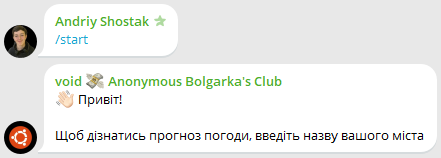
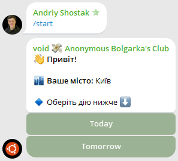

# ⛅ Weather bot

Telegram-бот для перегляду прогнозу погоди


[](https://wakatime.com/badge/user/5f28d705-3bc8-4138-8151-e12e0f9e9a23/project/4d3d812f-19d8-4e42-9ea5-2c7bd2a7e8fb)


## ⚡ Основний функціонал

- 🏙️ **Реєстрація міста** - користувач встановлює своє місто для отримання прогнозу.
- 🌤️ **Прогноз погоди на сьогодні** - всі важливі метрики.
- 📅 **Прогноз погоди на завтра** - аналогічно для наступного дня.
- 🔄 **Оновлення прогнозу** - завжди актуальна інформація через виклик API.
- 🎨 **Зручний UI** - структуровані повідомлення, callback query, емодзі...


## 🖼️ Приклад роботи

### Реєстрація користувача



### Вигляд головного меню



## 🧰 Технології

- [Rust](https://www.rust-lang.org/) - основна мова розробки

- [teloxide](https://github.com/teloxide/teloxide) - фреймовк для створення Telegram-ботів

- [SQLite](https://sqlite.org/) - БД для зберігання міст користувачів

- [OpenWeatherAPI](https://openweathermap.org/) - звідки береться прогноз погоди


## 📦 Збірка та запуск

>  У вас повинен бути встановлений пакетний менеджер Cargo

### Встановлюємо секретики

1. Створюємо .env файл
    ```bash
    cp .env.example .env
    ```
   
2. Заповнюємо його

    ```bash
    TELEGRAM_TOKEN = "Токен_вашого_телеграм_бота"

    WEATHER_API_KEY = "Токен_від_open_weather_api"
    ```

### Збираємо проект

```bash
cargo build
```

### Запускаємо

```bash
cargo run
```

## 🛡 Ліцензія
Цей проєкт ліцензовано під [MIT License](./LICENSE).


## ✨ Автор

<table>
  <tr>
    <td align="center">
      <a href="https://github.com/noinsts">
        
        <br />
        <sub><b>noinsts</b></sub>
      </a>
    </td>
  </tr>
</table>
